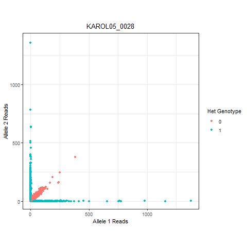
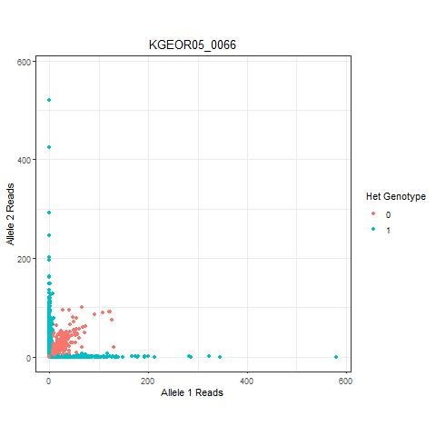
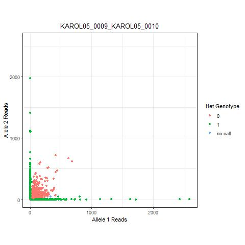
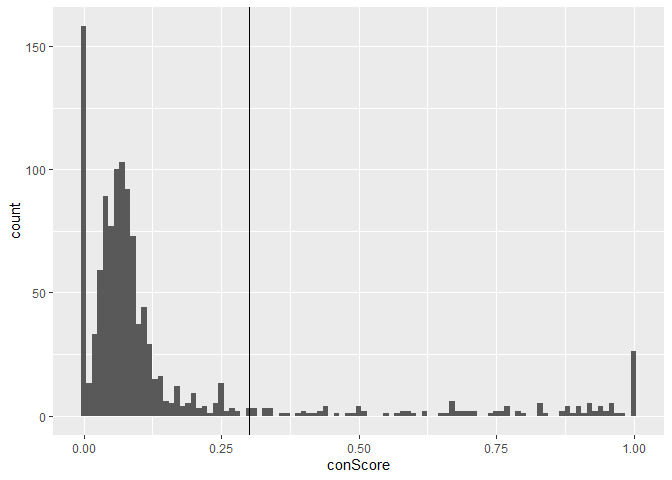
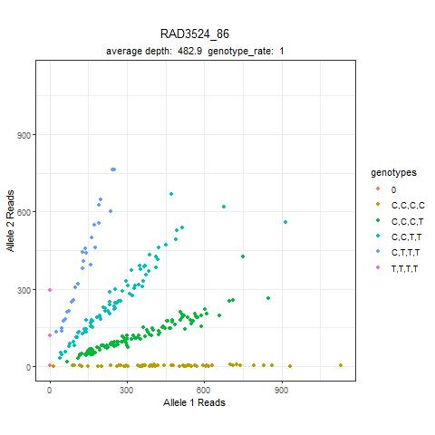
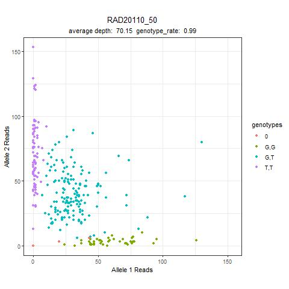
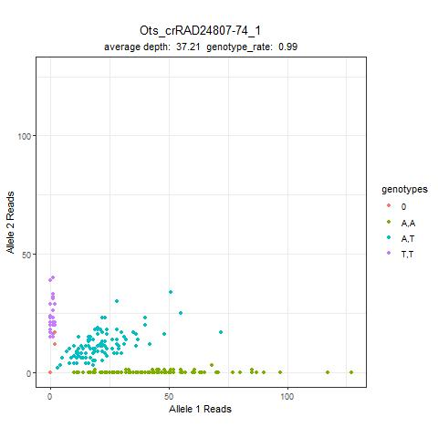

GT-score: Pipeline for genotyping and troubleshooting amplicon
sequencing data
================
Garrett McKinney
6/23/2020

<!-- README.md is generated from README.Rmd. Please edit that file -->

## About the data

The raw sequence data used for this example is a subset of the data
from: McKinney et al. 2020. Dense SNP panels resolve closely related
Chinook salmon populations. Canadian Journal of Fisheries and Aquatic
Sciences (77) 451-461. DOI: 10.1139/cjfas-2019-0067

Sequence data can be downloaded from NCBI BioProject PRJNA561127

I have also made three “contaminated” samples by combining sequence
reads from the following individuals: KAROL05\_0009 and KAROL05\_0010,
KAROL05\_0025 and KAROL05\_0026, and KAROL05\_0028 and KAROL05\_0029.
These are used to demononstrate how to identify contaminated samples.

## Count reads for amplicons

The read counter is written in perl (AmpliconReadCounter.pl).

The program:

1.  Identifies each unique sequence, then counts the number of times
    each unique sequence occurs within an individual

2.  Aligns each unique sequence with primer and probe; if the sequence
    doesn’t align, then it is excluded as an off-target sequence and
    reports by individual and by locus are given.

<!-- end list -->

  - Note: By default, all primers are trimmed to the length of the
    shortest primer to increase speed. Optionally the full length primer
    can be used for the primer but this may significantly increase run
    timing depending on variation in primer lengths across loci.

Input flags for this script are:

  - –p a tab delimited file containing primer/probe information for each
    locus
  - –files a text file containing a list of .fastq sequence files to
    count reads from.

Optional flags:

  - –prefix optional prefix for output file names
  - –inDir option to specify directory containing sequence data
  - –inputType fq or fastqgz (defaults to fastqgz)
  - –useFullPrimer uses the full primer for counting reads rather than
    the trimmed primer
  - –alleleOrder order of alleles output in locusTable file. Options are
    original (matches primer-probe file order) or alphabetical (default)
  - –printMatched outputs matched reads for each individual
  - –printDiscarded outputs discarded reads for each individual

AmpliconReadCounter.pl can be run on the command line or called from R

#### Setting up directories and running AmpliconReadCounterl.pl

create a folder with the sampleFile.txt file containing names of all the
samples you’d like to genotype

You can run AmpliconReadCounter.pl from the command line using the
following example: perl AmpliconReadCounter.pl -p primerProbeFile.txt
–files sampleList.txt

If you prefer to run this through R then you can use the following
example:

``` r
system2("perl",
        args="AmpliconReadCounter.pl -p primerProbeFile.txt --files sampleFiles.txt")
```

AmpliconReadCounter.pl outputs a LocusTable file and an AlleleReads file
for single-SNP and haplotype data, plus two summary files.

The default names for these files are:

  - LocusTable\_singleSNPs.txt
  - AlleleReads\_singleSNPs.txt
  - LocusTable\_haplotypes.txt
  - AlleleReads\_haplotypes.txt
  - GTscore\_individualSummary.txt
  - GTscore\_locusSummary.txt

<!-- end list -->

``` r
#load GTscore
source("GTscore.R")

#load locus table and allele reads file
singleSNP_locusTable<-read.delim("LocusTable_singleSNPs.txt",header=TRUE,stringsAsFactors=FALSE)
singleSNP_alleleReads<-read.delim("AlleleReads_singleSNPs.txt",header=TRUE,row.names=1,stringsAsFactors=FALSE)

head(singleSNP_locusTable)
```

    ##           Locus_ID ploidy alleles
    ## 1 Ots_100884-287_1      2     C,T
    ## 2 Ots_101554-407_1      2     C,G
    ## 3 Ots_101704-143_1      2     G,T
    ## 4 Ots_102213-210_1      2     A,G
    ## 5 Ots_102414-395_1      2     A,G
    ## 6 Ots_102457-132_1      2     A,G

``` r
singleSNP_alleleReads[1:5,1:5]
```

    ##                  KEEK02_0001 KEEK02_0002 KEEK02_0003 KEEK02_0004 KEEK02_0005
    ## Ots_100884-287_1        0,84       29,37        0,51        0,37        0,73
    ## Ots_101554-407_1        0,94        0,81        0,82       24,26       0,107
    ## Ots_101704-143_1        35,0        54,0        63,0        20,0        4,32
    ## Ots_102213-210_1        0,15         4,7        0,12         0,9         0,9
    ## Ots_102414-395_1        16,0        0,10         9,6         3,3        0,16

## Genotyping

Genotyping is accomplished using the polyGen function. The genotyping
algorithm is described in McKinney et al. 2018 and is a maximum
likelihood algorithm capable of genotyping any number of alleles and
ploidy per locus. This allows genoyping of single SNPs as well as
microhaplotypes, and loci with elevated ploidy.

Two arguments are required for polyGen, the locusTable and alleleReads
files output by AmpliconReadCounter.

Optional arguments for polyGen are:

  - p\_thresh - threshold p-value for likelihood ratio test (default
    0.05)
  - epsilon - error rate for genotyping model (default 0.01)

<!-- end list -->

``` r
#generate singleSNP genotypes using the polyGen algorithm
polyGenResults_singleSNP<-polyGen(singleSNP_locusTable,singleSNP_alleleReads)

polyGenResults_singleSNP[1:5,1:5]
```

    ##                  KEEK02_0001 KEEK02_0002 KEEK02_0003 KEEK02_0004 KEEK02_0005
    ## Ots_100884-287_1 "T,T"       "C,T"       "T,T"       "T,T"       "T,T"      
    ## Ots_101554-407_1 "G,G"       "G,G"       "G,G"       "C,G"       "G,G"      
    ## Ots_101704-143_1 "G,G"       "G,G"       "G,G"       "G,G"       "T,T"      
    ## Ots_102213-210_1 "G,G"       "A,G"       "G,G"       "G,G"       "G,G"      
    ## Ots_102414-395_1 "A,A"       "G,G"       "A,G"       "A,G"       "G,G"

## Sample Summaries

load sample summary from AmpliconReadCounter

``` r
GTscore_individualSummary<-read.delim("GTscore_individualSummary.txt",header=TRUE,stringsAsFactors=FALSE)

head(GTscore_individualSummary)
```

    ##        Sample Total.Reads Off.target.Reads Primer.Only.Reads Primer.Probe.Reads
    ## 1 KEEK02_0001      244962            67436             92887              84639
    ## 2 KEEK02_0002      320926            92684            143384              84858
    ## 3 KEEK02_0003      297859            89582            142959              65318
    ## 4 KEEK02_0004      263027            79737            130565              52725
    ## 5 KEEK02_0005      284616            77930            113175              93511
    ## 6 KEEK02_0006      291600            87751            137316              66533
    ##   Off.target.Proportion Primer.Only.Proportion Primer.Probe.Proportion
    ## 1                  0.28                   0.38                    0.35
    ## 2                  0.29                   0.45                    0.26
    ## 3                  0.30                   0.48                    0.22
    ## 4                  0.30                   0.50                    0.20
    ## 5                  0.27                   0.40                    0.33
    ## 6                  0.30                   0.47                    0.23

summarize single SNP results for samples

``` r
singleSNP_sampleSummary<-summarizeSamples(polyGenResults_singleSNP)
head(singleSNP_sampleSummary)
```

    ##                      sample GenotypeRate Heterozygosity  conScore
    ## 1              KAROL05_0009    0.9826938      0.1963883 0.1762452
    ## 2 KAROL05_0009_KAROL05_0010    0.9947329      0.3754703 0.7374749
    ## 3              KAROL05_0010    0.9954853      0.2249812 0.1438127
    ## 4              KAROL05_0025    0.9924755      0.2129421 0.1236749
    ## 5 KAROL05_0025_KAROL05_0026    0.9939804      0.3739654 0.6881288
    ## 6              KAROL05_0026    0.9857035      0.1723100 0.1528384

combine AmpliconReadCounter individual summary data with GTscore sample
summary

``` r
GTscore_individualSummary<-merge(GTscore_individualSummary,singleSNP_sampleSummary,by.x="Sample",by.y="sample")
```

plot histogram of genotype rate

``` r
ggplot()+geom_histogram(data=GTscore_individualSummary,aes(x=GenotypeRate),binwidth=0.03)+xlim(-0.01,1.01)+
  labs(title="Sample Genotype Rate", x="Genotype Rate", y="Count")+
  theme_bw()+theme(plot.title=element_text(hjust=0.5),plot.subtitle=element_text(hjust=0.5))
```

<!-- -->

plot histogram of heterozygosity

``` r
ggplot()+geom_histogram(data=GTscore_individualSummary,aes(x=Heterozygosity),binwidth=0.03)+xlim(-0.01,1.01)+
  labs(title="Sample Heterozygosity", x="Heterozygosity", y="Count")+
  theme_bw()+theme(plot.title=element_text(hjust=0.5),plot.subtitle=element_text(hjust=0.5))
```

<!-- -->

plot genotype rate vs primer probe reads

``` r
#dashed line added at 90% genotype rate, this is not a strict threshold, just a goal to aim for
ggplot()+geom_point(data=GTscore_individualSummary,aes(x=Primer.Probe.Reads,y=GenotypeRate))+
  labs(title="Genotype Rate vs Total Reads per Sample", x="Primer Probe Reads", y="Genotype Rate")+
  theme_bw()+theme(plot.title=element_text(hjust=0.5),plot.subtitle=element_text(hjust=0.5))+
  geom_hline(yintercept=0.9,lty="dashed")
```

<!-- -->

samples with unusually high heterozygosity may be contaminated or have
elevated ploidy. In this case, the three “contaminated” samples that
were generated by combining reads from multiple individuals all show
elevated heterozygosity.

plot heterozygosity vs primer probe reads

``` r
ggplot()+geom_point(data=GTscore_individualSummary,aes(x=Primer.Probe.Reads,y=Heterozygosity))+
  labs(title="Heterozygosity vs Total Reads per Sample", x="Primer Probe Reads", y="Heterozygosity")+
  theme_bw()+theme(plot.title=element_text(hjust=0.5),plot.subtitle=element_text(hjust=0.5))+
  geom_hline(yintercept=0.3, lty="dashed")
```

<!-- -->

samples with unusually high heterozygosity relative to others are
candidates for contamination. The three contaminated samples again are
well outside the range of the other samples.

plot heterozygosity vs genotype rate per sample

``` r
ggplot()+geom_point(data=GTscore_individualSummary,aes(x=GenotypeRate,y=Heterozygosity))+
  labs(title="Heterozygosity vs Genotype Rate per Sample", x="Genotype Rate", y="Heterozygosity")+
  theme_bw()+theme(plot.title=element_text(hjust=0.5),plot.subtitle=element_text(hjust=0.5))
```

<!-- -->

A contamination score is included in the sample summary. The
contamination score is the proportion of heterozygous genotypes whose
allele ratios significantly differ from 1:1 ratios

The three contaminated samples all show elevated contamination scores
and heterozygosity relative to the rest of the samples.

plot heterozygosity vs contamination score per sample

``` r
ggplot()+geom_point(data=GTscore_individualSummary,aes(x=conScore,y=Heterozygosity))+
  labs(title="Heterozygosity vs Contamination Score per Sample", x="Contamination Score", y="Heterozygosity")+
  theme_bw()+theme(plot.title=element_text(hjust=0.5),plot.subtitle=element_text(hjust=0.5))
```

<!-- -->

## Locus Summaries

summarize single SNP results for loci

``` r
singleSNP_summary<-summarizeGTscore(singleSNP_alleleReads, singleSNP_locusTable, polyGenResults_singleSNP)

head(singleSNP_summary)
```

    ##           Locus_ID AvgReadDepth GenotypeRate      minAF     majAF alleles
    ## 1 Ots_100884-287_1    40.470803    0.9927273 0.12454212 0.8754579     C,T
    ## 2 Ots_101119-381_1    18.021978    0.9745455 0.00000000 1.0000000     C,T
    ## 3 Ots_101554-407_1    48.861818    1.0000000 0.08909091 0.9109091     C,G
    ## 4 Ots_101704-143_1    34.617647    0.9890909 0.03308824 0.9669118     G,T
    ## 5  Ots_101770-82_1    30.385455    1.0000000 0.00000000 1.0000000     G,T
    ## 6 Ots_102213-210_1     9.360294    0.9345455 0.01556420 0.9844358     A,G
    ##    allFreqs   conScore
    ## 1 0.12,0.88 0.04687500
    ## 2       1,0        NaN
    ## 3 0.09,0.91 0.00000000
    ## 4 0.97,0.03 0.08333333
    ## 5       1,0        NaN
    ## 6 0.02,0.98 0.25000000

``` r
#write results
write.table(singleSNP_summary,"singleSNP_summary.txt",quote=FALSE,sep="\t",row.names=FALSE)
```

Generate plots for single SNP results

plot genotype rate

``` r
ggplot()+geom_histogram(data=singleSNP_summary,aes(x=GenotypeRate),binwidth=0.03)+xlim(-0.01,1.01)+
  labs(title="Locus Genotype Rate", x="Genotype Rate", y="Count")+
  theme_bw()+theme(plot.title=element_text(hjust=0.5),plot.subtitle=element_text(hjust=0.5))
```

<!-- -->

plot average read depth for single SNP data

``` r
ggplot()+geom_histogram(data=singleSNP_summary,aes(x=AvgReadDepth),binwidth=20)+
  labs(title="Average Read Depth per SNP", x="Average Read Depth", y="Count")+
  theme_bw()+theme(plot.title=element_text(hjust=0.5),plot.subtitle=element_text(hjust=0.5))
```

<!-- -->

plot genotype rate relative to average depth

``` r
ggplot()+geom_point(data=singleSNP_summary,aes(x=AvgReadDepth,y=GenotypeRate))+ylim(0,1)+
  labs(title="Genotype Rate vs Average Depth per SNP", x="Average Depth", y="Genotype Rate")+
  theme_bw()+theme(plot.title=element_text(hjust=0.5),plot.subtitle=element_text(hjust=0.5))
```

<!-- -->

plot distribution of minor allele frequency

``` r
ggplot()+geom_histogram(data=singleSNP_summary,aes(x=minAF),binwidth=0.01)+
  labs(title="Minor Allele Frequency Single SNP", x="Minor Allele Frequency", y="Count")+
  theme_bw()+theme(plot.title=element_text(hjust=0.5),plot.subtitle=element_text(hjust=0.5))
```

<!-- -->

plot distribution of major allele frequency

``` r
ggplot()+geom_histogram(data=singleSNP_summary,aes(x=majAF),binwidth=0.01)+
  labs(title="Major Allele Frequency Single SNP", x="Major Allele Frequency", y="Count")+
  theme_bw()+theme(plot.title=element_text(hjust=0.5),plot.subtitle=element_text(hjust=0.5))
```

<!-- -->

## Quality Control

#### Identify duplicate samples

The IDduplicateSamples function does all pairwise comparisons of samples
and outputs two metrics:

  - proportionCommon - The proportion of loci that had genotypes for
    both samples in a pair
  - proportionMatch - The proportion of loci that have identical
    genotypes in the sample pair

<!-- end list -->

``` r
#convert missing genotypes "0" to NA
polyGenResults_singleSNP_NA<-polyGenResults_singleSNP
polyGenResults_singleSNP_NA[polyGenResults_singleSNP_NA=="0"]<-NA

#compare all samples, for each comparison get proportion of loci that have genotypes
#in both samples (proportionCommon) and proportion of shared loci that have identical
#genotypes (proportionMatch).
#Samples with a high proportionCommon and high proportionMatch are likely duplicates
polyGenResults_dupTest<-IDduplicateSamples(polyGenResults_singleSNP_NA)

write.table(polyGenResults_dupTest,"polyGenResults_dupTest.txt",quote=FALSE,sep="\t",row.names=FALSE)
```

``` r
polyGenResults_dupTest<-read.delim("polyGenResults_dupTest.txt",stringsAsFactors=FALSE)
head(polyGenResults_dupTest)
```

    ##       Sample1     Sample2 matchedGenotypes commonGenotypes proportionMatch
    ## 1 KEEK02_0001 KEEK02_0002              903            1300       0.6946154
    ## 2 KEEK02_0001 KEEK02_0003              873            1289       0.6772692
    ## 3 KEEK02_0001 KEEK02_0004              915            1292       0.7082043
    ## 4 KEEK02_0001 KEEK02_0005              895            1303       0.6868764
    ## 5 KEEK02_0001 KEEK02_0006              892            1296       0.6882716
    ## 6 KEEK02_0001 KEEK02_0007              885            1297       0.6823439
    ##   proportionCommon totalLoci
    ## 1        0.9781791      1329
    ## 2        0.9699022      1329
    ## 3        0.9721595      1329
    ## 4        0.9804364      1329
    ## 5        0.9751693      1329
    ## 6        0.9759217      1329

polyGenResults\_dupTest

Plot results of IDduplicateSamples

I generally set thresholds of proportionMatch \> 0.8 and
proportionCommon \> 0.75 to identify duplicate sample pairs. The
appropriate thresholds will depend on the marker set being used and the
relatedness among samples. In this plot, it is possible that individuals
at the lower range of identical genotypes (\~0.85) are relatives rather
than duplicated samples.

``` r
#potential duplicates are proportionMatch>0.8 and proportionCommon>0.75
#feel free to adjust these thresholds as needed
matchThresh=0.8
commonThresh=0.75

#plot results
ggplot()+geom_point(data=polyGenResults_dupTest,aes(x=proportionCommon,y=proportionMatch))+
  geom_segment(aes(x=commonThresh,xend=1,y=matchThresh,yend=matchThresh),lty="dashed")+
  geom_segment(aes(x=commonThresh,xend=commonThresh,y=matchThresh,yend=1),lty="dashed")
```

<!-- -->

Identify duplicate sample pairs with thresholds set previously

``` r
#filter to potentially duplicated samples using thresholds above
polyGenResults_dupTest %>% filter(proportionMatch>=matchThresh,proportionCommon>=commonThresh)
```

    ##         Sample1                   Sample2 matchedGenotypes commonGenotypes
    ## 1  KAROL05_0010              KAROL05_0049             1306            1310
    ## 2  KAROL05_0010 KAROL05_0009_KAROL05_0010             1110            1317
    ## 3  KAROL05_0025 KAROL05_0025_KAROL05_0026             1088            1313
    ## 4  KAROL05_0028 KAROL05_0028_KAROL05_0029             1099            1324
    ## 5  KAROL05_0029 KAROL05_0028_KAROL05_0029             1084            1319
    ## 6  KAROL05_0049 KAROL05_0009_KAROL05_0010             1099            1308
    ## 7  KGEOR05_0061              KGEOR05_0062             1097            1308
    ## 8  KGEOR05_0061              KGEOR05_0063             1096            1307
    ## 9  KGEOR05_0062              KGEOR05_0063             1307            1313
    ## 10 KGEOR05_0085              KGEOR05_0704             1319            1321
    ##    proportionMatch proportionCommon totalLoci
    ## 1        0.9969466        0.9857035      1329
    ## 2        0.8428246        0.9909707      1329
    ## 3        0.8286367        0.9879609      1329
    ## 4        0.8300604        0.9962378      1329
    ## 5        0.8218347        0.9924755      1329
    ## 6        0.8402141        0.9841986      1329
    ## 7        0.8386850        0.9841986      1329
    ## 8        0.8385616        0.9834462      1329
    ## 9        0.9954303        0.9879609      1329
    ## 10       0.9984860        0.9939804      1329

#### Identify contaminated samples

Contaminated samples can be identified through elevated heterozygosity

``` r
#plot heterozygosity vs genotype rate per sample
#samples with unusually high heterozygosity relative to others are candidates for contamination
#the sample above the dashed line in this example is likely contaminated
ggplot()+geom_point(data=GTscore_individualSummary,aes(x=GenotypeRate,y=Heterozygosity))+
  labs(title="Heterozygosity vs Genotype Rate per Sample", x="Genotype Rate", y="Heterozygosity")+
  theme_bw()+theme(plot.title=element_text(hjust=0.5),plot.subtitle=element_text(hjust=0.5))+
  geom_hline(yintercept=0.30, lty="dashed")
```

-1.png)<!-- -->

Set heterozygosity treshold to identify likely contaminated sample

``` r
#identify likely contaminated sample
contaminatedSample<-GTscore_individualSummary %>% filter(Heterozygosity>0.30) %>% pull(Sample)
contaminatedSample
```

    ## [1] "KAROL05_0009_KAROL05_0010" "KAROL05_0025_KAROL05_0026"
    ## [3] "KAROL05_0028_KAROL05_0029"

Contaminated samples can alao be identified by an elevated contamination
score. In this example, samples with a contamination score \> 0.3 are
known to be contaminated.

``` r
#plot histogram of contamination score
ggplot()+geom_histogram(data=GTscore_individualSummary,aes(x=conScore),binwidth=0.02)+geom_vline(xintercept=0.3,lty="dashed")
```

<!-- -->

Set contamination score treshold to identify contaminated samples

``` r
#identify likely contaminated samples
contaminatedSamples2<-GTscore_individualSummary %>% filter(conScore>=0.3) %>% pull(Sample)
contaminatedSamples2
```

    ## [1] "KAROL05_0009_KAROL05_0010" "KAROL05_0025_KAROL05_0026"
    ## [3] "KAROL05_0028_KAROL05_0029"

Plot genotype scatterplots for each sample

``` r
#Scatter Plots can show evidence of contamination or elevated ploidy
plotGenotypes_sample(singleSNP_locusTable, singleSNP_alleleReads, polyGenResults_singleSNP, type='scatter', savePlot="Y", saveDir="scatterPlots_sample")
#look at plots for samples, particularly for putatively contaminated samples identified by high heterozygosity
```

This is an example of a sample with no signs of contamination



This is an example of a potentially moderately contaminated sample



This is an example of a one of the contaminated samples that we created
by combining reads from two individuals



#### Identify poor quality loci to remove

Flag SNPs with \< 50% genotype rate as candidates for removal

``` r
poorQualitySNPs<-singleSNP_summary %>% filter(GenotypeRate<0.5) %>% mutate(Locus_ID=as.character(Locus_ID)) %>% pull(Locus_ID)
poorQualitySNPs
```

    ## [1] "Ots_129170-683_1" "Ots_RAD10099_1"   "Ots_U2305-63_1"   "RAD21430_84"

Scatter Plots can show evidence of systemic issues in read counting
(off-target reads, biases) or elevated ploidy

Plot genotype scatterplots per locus

``` r
plotGenotypes(singleSNP_locusTable, singleSNP_alleleReads, polyGenResults_singleSNP, type='scatter', savePlot="Y", saveDir="scatterPlots_loci")
```

plot histogram of contamination score for loci. An arbitrary score of
0.3 was set to identify problematic loci, but a lower or higher
threshold may be more suitable. Visual examinstion of loci with elevated
scores is recommended. In cases where there are very few heterozygous
individuals, a high contamination score may be not truly reflect locus
performance..

``` r
#loci with high contamination scores should have scatterplots examined to ensure genotypes look accurate
singleSNP_summary %>% ggplot(data=.) + geom_histogram(aes(x=conScore),binwidth=0.01)+geom_vline(xintercept=0.3)
```

<!-- -->

Plot contamination score vs minor allele frequency. Loci with both a
high contamination score and high minor allele frequency are likely to
be problematic.

``` r
singleSNP_summary %>% ggplot(data=.) + geom_point(aes(x=conScore,y=minAF))
```

<!-- -->

<!-- Get list of loci with high contamination score -->

<!-- ```{r} -->

<!-- singleSNP_summary %>% filter(conScore>0.3) -->

<!-- ``` -->

``` r
write.table(polyGenResults_singleSNP,"polyGenResults_singleSNP.txt",quote=FALSE,sep="\t")
```

Look at scatterplots for loci with high contamination score

Example of a paralog



Example of a locus with with likely off-target sequence



Example of a locus that has high contamination score but may be fine



## Export Files

When exporting files, you can either export the full results and remove
any poor quality samples or loci afterwards, or you can use whitelists
or blacklists to filter during export. Both the exportGenepop and
exportRubias functions have the following options: sampleWhitelist,
locusWhitelist, sampleBlacklist, locusBlacklist. The whitelists are a
list of samples or loci to retain, the blacklists are lists of samples
or loci to discard.

#### Genepop format

export genepop format with no filtering

``` r
#example with no filtering
exportGenepop(polyGenResults_singleSNP,singleSNP_locusTable,filename="polyGenResults_singleSNP_genepop.txt")
```

export genepop format with poor quality loci and contaminated sample
removed

``` r
#example with poor quality loci and contaminated sample removed
exportGenepop(polyGenResults_singleSNP,singleSNP_locusTable,
              locusBlacklist=poorQualitySNPs,sampleBlacklist=contaminatedSample,
              filename="polyGenResults_singleSNP_genepop_filtered.txt")
```

#### Rubias format

Data output for Rubias should have metadata associated with each sample
that specifies the sample type, mixture if a mixture sample, reference
if a baseline sample, the reporting group, the sample collection, and
individual name.

Sample metadata columns should have the following names: sample\_type,
repunit, collection, indiv

metadata can be created here or loaded from file

create sample metadata for mixture sample

``` r
sampleMetaData<-data.frame(sample_type="mixture",repunit=NA,collection="SSCK17P2",indiv=colnames(polyGenResults_singleSNP))
head(sampleMetaData)
```

    ##   sample_type repunit collection       indiv
    ## 1     mixture      NA   SSCK17P2 KEEK02_0001
    ## 2     mixture      NA   SSCK17P2 KEEK02_0002
    ## 3     mixture      NA   SSCK17P2 KEEK02_0003
    ## 4     mixture      NA   SSCK17P2 KEEK02_0004
    ## 5     mixture      NA   SSCK17P2 KEEK02_0005
    ## 6     mixture      NA   SSCK17P2 KEEK02_0006

export Rubias format with no filtering

``` r
exportRubias(polyGenResults_singleSNP,singleSNP_locusTable,sampleMetaData,filename="polyGenResults_singleSNP_rubias.txt")
```

export Rubias format with poor quality loci and contaminated sample
removed

``` r
exportRubias(polyGenResults_singleSNP,singleSNP_locusTable,sampleMetaData,
             locusBlacklist=poorQualitySNPs,sampleBlacklist=contaminatedSample,
             filename="polyGenResults_singleSNP_rubias_filtered.txt")
```
